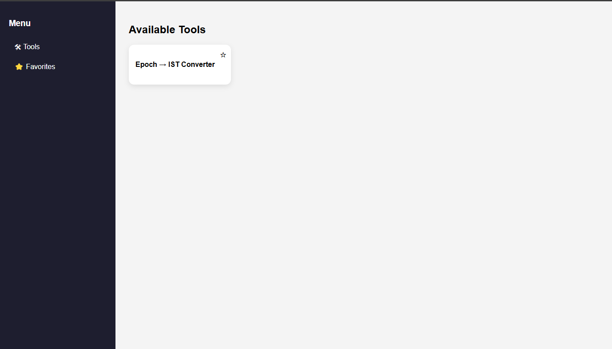
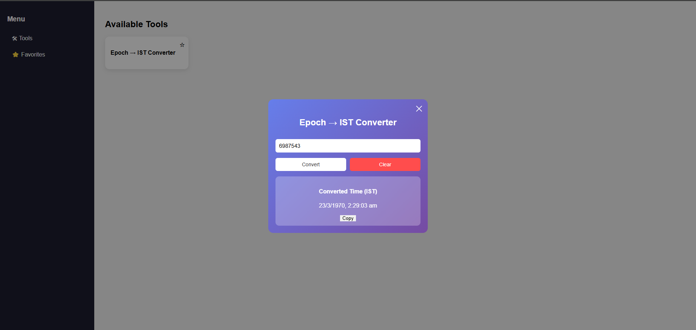

# Mini Tool App


A lightweight **modular tool platform** built using **Vanilla JavaScript** that allows developers to easily add utilities by simply dropping a folder containing HTML, CSS, and JS.

The project focuses on **simplicity, scalability, and contributor friendliness**.

---

# Preview

| Home | Epoch Tool |
|-----|-----|
|  |  |
 

---

# Key Features

* Modular plugin-style tool architecture
* Add new tools without touching core code
* Hash-based router for static hosting
* Favorites system using LocalStorage
* Progressive Web App support
* Chrome Extension support
* Responsive design
* Dynamic tool loading
* Full HTML tool support

---

# Project Architecture

```
mini-tool-app
│
├ index.html
├ main.js
├ style.css
├ manifest.json
├ service-worker.js
├ tools.json
│
├ tools
│   ├ epoch
│   │   ├ index.html
│   │   ├ style.css
│   │   ├ script.js
│   │   └ tool.json
│   │
│   └ password-generator
│       ├ index.html
│       ├ style.css
│       ├ script.js
│       └ tool.json
│
└ extension
    ├ manifest.json
    ├ popup.html
    ├ popup.js
    └ style.css
```

---

# Tool Plugin System

Each tool is a **self-contained module**.

A tool must contain:

```
index.html
style.css
script.js
tool.json
```

Example:

```
tools/epoch/
```

### tool.json

Defines tool metadata.

```
{
  "id": "epoch",
  "name": "Epoch → IST Converter",
  "icon": "⏱"
}
```

---

# Tool Registry

`tools.json` registers all tools in the app.

```
[
  "tools/epoch/tool.json",
  "tools/password-generator/tool.json"
]
```

The application loads tools dynamically at runtime.

---

# Router System

Since this project is **static-host friendly**, it uses a **hash router**.

Routes:

```
#/              → tools list
#/favorites     → favorites page
#/tool/{id}     → tool page
```

Example:

```
#/tool/epoch
#/tool/password-generator
```

---

# Tool Loading Mechanism

When a tool route is opened:

1. Router fetches `index.html`
2. HTML is parsed using `DOMParser`
3. `<body>` is injected into the main application container
4. Tool CSS and scripts are dynamically loaded

This allows developers to write **normal HTML pages** for tools.

---

# Progressive Web App

The application includes full **PWA support**.

Features:

* Web Manifest
* Service Worker
* Offline caching
* Installable application
* Mobile friendly

Users can install the app like a native application.

---

# Chrome Extension

The project also includes a **Chrome Extension version**.

Location:

```
extension/
```

The extension provides quick access to tools inside the browser.

To install locally:

1. Open Chrome
2. Go to `chrome://extensions`
3. Enable **Developer Mode**
4. Click **Load Unpacked**
5. Select the `extension` folder

---

# Example Tools

Currently implemented tools:

* Epoch → IST Converter
* Password Generator

More tools can be easily added.

---

# How to Add a New Tool

Create a new folder:

```
tools/my-tool
```

Add the required files:

```
index.html
style.css
script.js
tool.json
```

Example `tool.json`:

```
{
  "id": "my-tool",
  "name": "My Tool",
  "icon": "🛠"
}
```

Register it in `tools.json`:

```
[
  "tools/epoch/tool.json",
  "tools/password-generator/tool.json",
  "tools/my-tool/tool.json"
]
```

No changes to core application code are required.

---

# Development Setup

Clone the repository:

```
git clone https://github.com/UdayRaj2003/mini-tool-app.git
```

Run using a local server.

Recommended:

```
VS Code Live Server
```

Some environments like `npx serve .` may cause path resolution issues with nested tool routes.

---

# Challenges Faced During Development

Several architectural challenges were encountered while building the plugin system.

### Full HTML Tool Support

Contributors naturally write complete HTML pages.

The router was updated to parse the HTML and inject only the `<body>` into the application.

### Script Scope Conflicts

Switching tools could cause scripts to run multiple times leading to errors such as:

```
Identifier already declared
```

Tools were isolated to avoid global scope conflicts.

### Static Routing Limitations

Traditional routing leads to `404` errors in static hosting environments.

This was solved using a **hash router**.

### Development Server Differences

Different servers handled nested paths differently.

`npx serve .`

* Caused asset resolution issues.

VS Code Live Server

* Worked consistently.

---

# Roadmap

Future improvements planned:

* automatic tool discovery
* tool search
* tool categories
* tool marketplace
* theme support
* tool sandboxing
* user tool uploads

---

# Contributing

Contributions are welcome.

Steps:

1. Fork the repository
2. Create a new branch
3. Add your tool
4. Update `tools.json`
5. Submit a Pull Request

---

# License

Apache License
